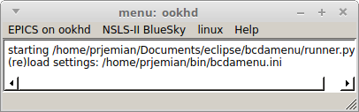
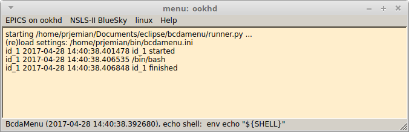

############################
History panel in main window
############################

.. index:: history
.. index:: debug

With version 2017.4.0, the *BcdaMenu* was transformed from a *button window* style
to a *main window* style of application.  This change gained several features:

* keyboard motion between the various menus and menu items
* a status line to report program information (like the *unimenu* predecessor of *BcdaMenu*)
* a main window panel to gather any command output and show history

The history panel (like real history) cannot be changed after it has been written.
Both *stderr* and *stdout* from any command are combined and reported in the window.
There are options (under the *Help* menu) to control what is written to the 
history.

Since the original program did not have a history panel, the default is to not display
the history panel.  Again, the *Help* menu has an item to show/hide the history.

.. _example_history:

   History panel is shown.

.. _example_history_debug:

   History panel is shown with debugging turned on.  
   This shows when commands are started and stopped.
   All lines are time stamped with debugging turned on.
   