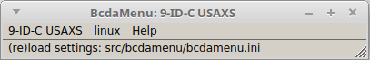
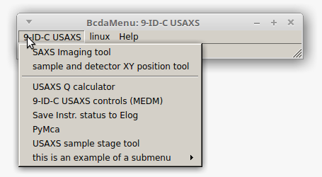
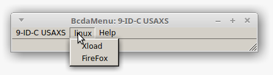
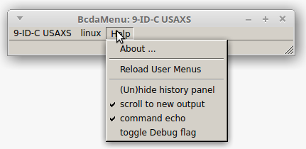

.. _settings_file:

Settings File
#############

.. index:: 
   settings file

The **BcdaMenu** GUI is configured by the content provided in
a settings file which name is specified on the command line
when starting the program.  For example, this Linux command::

    bcdamenu path/to/menus_settings.ini &

Version "2017.3.0" format of the Settings file
**********************************************

.. index:: settings file; version 2017.3.0

The settings file version `2017.3.0` uses the `.ini` format, 
a structure similar to what you would find 
in Microsoft Windows INI files.  This format was
chosen for its minimal approach to language markup.
The examples provided should guide you to the syntax.
For more details, see the documentation for the
Python `ConfigParser 
<https://docs.python.org/2/library/configparser.html>`_.
The `web <https://en.wikipedia.org/wiki/INI_file>`_
has many explanations of this informal format.

Settings file elements
======================

The settings file consists of sections which are lines
starting with "`[`" and ending with "`]`", such as `[section_name]`.  
In **BcdaMenu**,
these sections are single words with no embedded white space.

Within a section, one or more lines are given with the syntax of
`key = value` (or `key: value`).  It is expected by the `.ini` format that
any key is unique *within* its section.  In **BcdaMenu**, the `key` has two parts.  
First an integer is given that is used to sort the menu's items in order`.  
The integer is not required to be strictly increasing from 1.  Gaps and 
negative numbers are also allowed.  Keep the integers between -9999 .. 9999 to
avoid any potential misunderstandings.  You *will not* have that many menu items.

Refer to the :ref:`Example settings file <example.settings.file>`
section for an example settings file.  As the examples show, both `key` and `value`
are quite flexible strings.  A `key` should not contain either the "`:`"
or "`=`" separator characters.  The comment characters allowed by the 
`.ini` format should also be avoided within either `key` or `value` content.

:{BcdaMenu] section: This section expects the following keys and values.
   Other keys and values will be ignored.

   :title: The window title (default: *BCDA Menu*)
   :version: The version of the settings file format.
     Presently, the only allowed value is `2017.3.0`,
     the settings format of the initial release.
     If this format ever changes, this key will be used to
     identify how to handle the different syntax of the 
     settings file of the new version.

   :menus: Names of the sections below with menu specifications.
      Its value may have more than one menu name, 
      separated by white space.

:menu sections: As referenced by `menus` or `submenu` keys.
   Each menu section must have a one-word name with no
   internal white space (to simplify the
   parsing of names in the `[BcdaMenu]` section.

:other sections: will be ignored

Menu Sections
-------------

Each popup menu is configured by the keys and values of a 
menu section.

:title: Use this as the title on the popup button or submenu name.
   If the `title` key is not present, the name of the menu section
   will be used as the text of the popup button.

:separator: draws a horizontal separator line in the menu
:numbered lines: specification of a menu item

   * syntax: `index label = command`
   
   where:
   
   :index: an integer used to sort the list numerically (increasing)
   :label: text that appears in the menu
   
      NOTE: `submenu` is a special label for a feature
      yet to be supported.  The value defines the name of the 
      submenu section to insert at this position in the menu.
      
      * `title` is reserved word and cannot be used as a menu item label
      * `separator` is reserved word and cannot be used as a menu item label
   
   :command: Operating system command to be executed when menu 
      item is chosen.  This is a complete command in the operating
      system syntax that will be started as a separate task
      by **BcdaMenu**.  
      
      Linux: There is no need to append ` &` to run the commands
      in the background.

Shortcut keys
-------------

Shortcut keys are not supported for any menu items.

.. _example.settings.file:

Example Settings File
=====================

.. index:: 
   settings file; example

The settings file in the source code distribution
(:download:`download <../../src/bcdamenu/bcdamenu.ini>`, 
also shown below)
is an example demonstrating the various
features used by **BcdaMenu**.

file
----

The example settings file (highlighted lines show the 
sections, lines 1, 6, & 19 and the specification of 
the popup menus, line 4) is shown next.  Note that the
submenu (referenced on line 16 with content specified
on line 23) is an unimplemented feature at this time.

.. literalinclude:: ../../src/bcdamenu/bcdamenu.ini
   :language: ini
   :linenos:
   :emphasize-lines: 1,4,6,19,23

screens
-------

This settings file produces a GUI titled *9-ID-C USAXS menu*
with two user menus: *USAXS* and *linux*.  The following
screen views are from an early version, running on MS Windows.

.. _example_gui:

   GUI using example settings file.

This is the *USAXS* menu:

.. _example_gui.usaxs_menu:

   GUI using example settings file, showing the *USAXS* menu.

This is the *linux* menu:

.. _example_gui.linux_menu:

   GUI using example settings file, showing the *linux* menu.

.. _Help:

The "Help" popup menu button
****************************

The *Help* popup menu button is controlled by the program and is not configurable
by the user through the settings file.

This is the *Help* menu:

.. _example_gui.help_menu:

   GUI showing the *Help* menu.

These items are available in the *Help* popup menu:

* *About ...* : prints to the console basic information about this program
* *Reload User Menus* : reloads the settings file (use this when editing/revising that file)
